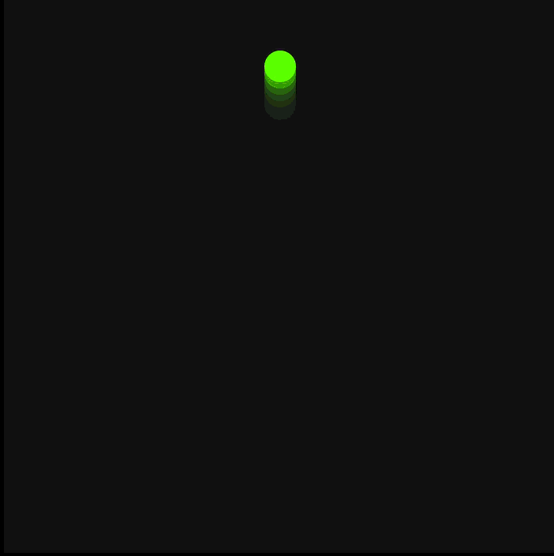
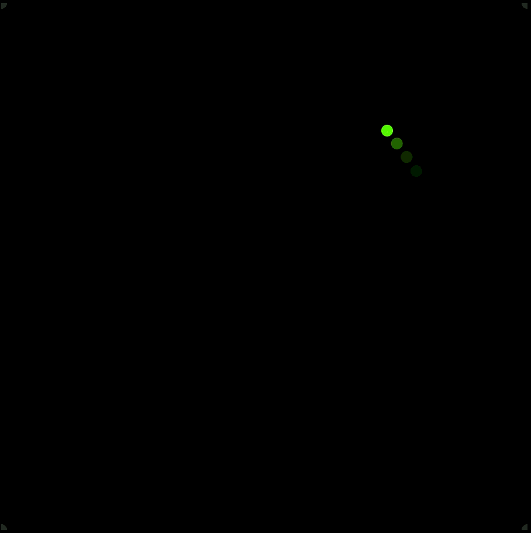

# Html Animations of Bouncing Balls

Just some simple bouncing ball animations I made while getting my hands dirty with basic physics and HTML5 Canvas.

_CollideAndMultiply-TotalChaos.js 👇👇_


## No Libraries, Just Math

Everything here is built with just HTML and vanilla JavaScript. No packages, no `npm install`, and no external libraries. It’s just me trying to figure out the math behind movement.

## Why it's not "Perfect"

You might notice the animations don't look 100% realistic. That's because browsers can be a bit weird when handling tiny decimal (float) values in high-speed animations. This isn't a professional physics engine—just a fun attempt at getting close to reality.

---

## What’s in here?

There are three scripts you can play with:

### 1. `simpleBounce.js`

The most basic one. A single ball bouncing straight up and down.


### 2. `gravitylike-2D-Bounce.js`

An attempt to add horizontal movement and gravity. It includes energy loss, so the ball eventually stops bouncing.


### 3. `CollideAndMultiply-TotalChaos.js`

This is where things get messy. Balls bounce off each other, hit the walls, and multiply. It's a bit of chaos just to see how much the browser can handle.

---

## How to run it

1. Download the files.
2. Open `index.html` in any web browser.

### Swapping scripts

If you want to try a different animation, open `index.html` in a text editor and change the filename in the `<script>` tag:

```html
<script src="CollideAndMultiply-TotalChaos.js"></script>
```

Just swap `CollideAndMultiply-TotalChaos.js` with one of the other filenames and refresh your browser.

---

_hmm... animations are fun._
